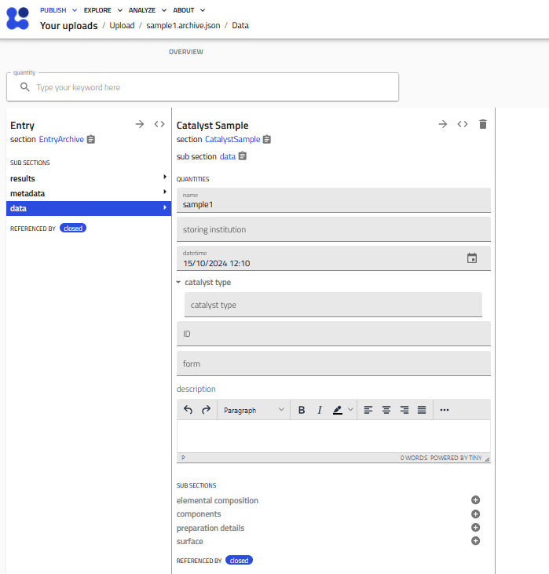
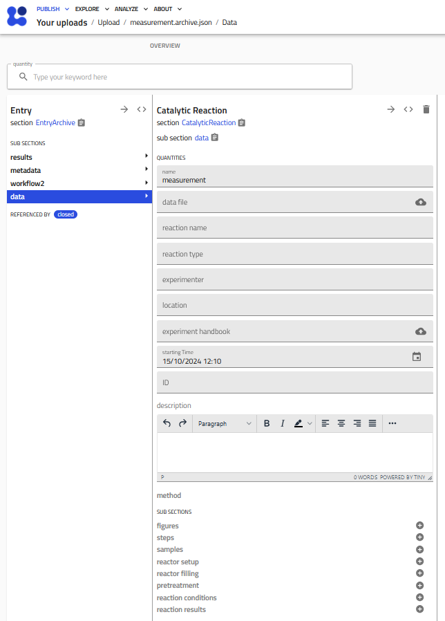
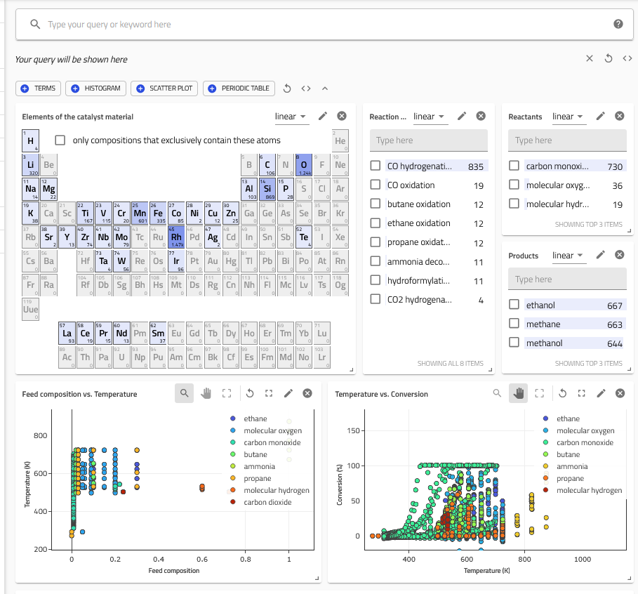

# Tutorial

This tutorial walks you through a complete example of using the **nomad-catalysis** plugin — from uploading catalyst and reaction data to exploring results in the Catalysis App. We use real data from a CuZnAl methanol synthesis catalyst published in [Schumann et al., *ChemCatChem* **6**, 2832–2839 (2014)](https://doi.org/10.1002/cctc.201402278).

## Prerequisites

- A NOMAD account (create one at [nomad-lab.eu](https://nomad-lab.eu))
- The **nomad-catalysis** plugin must be available on your NOMAD instance (it is pre-installed on the [central NOMAD](https://nomad-lab.eu/prod/v1/gui/) and the [Example Oasis](https://nomad-lab.eu/prod/v1/oasis/gui/))

## Step 1: Access the Example Upload

The plugin ships with a built-in example upload containing real catalysis data. To use it:

1. Log in to your NOMAD instance
2. Navigate to **PUBLISH** → **Uploads**
3. Click **CREATE A NEW UPLOAD**
4. In the upload page, look for the blue **Drop Files Here** bar and upload [this zip folder](https://raw.githubusercontent.com/FAIRmat-NFDI/nomad-catalysis-plugin/main/scr/nomad_catalysis/example_uploads/het_catalysis_example/example_MeOHsyn.zip).

The example upload contains three files:

| File | Description |
|------|-------------|
| `catalysis_sample.archive.json` | A CuZnAl catalyst sample entry |
| `methanol_synthesis.archive.json` | A catalytic reaction entry for methanol synthesis |
| `methanol_synthesis_CuZnAl.xlsx` | Excel data file with reaction conditions and results |

## Step 2: Review the Catalyst Sample Entry

After the upload is processed, open the **CuZnAl methanol synthesis catalyst** entry. This is a `CatalystSample` instance containing:

- **Name**: CuZnAl methanol synthesis catalyst
- **Lab ID**: FHI-S15018
- **Institution**: Fritz-Haber-Institut Berlin / Abteilung AC
- **Catalyst type**: bulk catalyst, oxide
- **Elemental composition**: Cu (55%), Zn (22.5%), Al (1.8%), O (20.9%)
- **Preparation**: precipitation method
- **Surface area**: 117.8 m²/g (BET method)

This demonstrates how the `CatalystSample` schema captures the key properties of a catalyst material in a structured, machine-readable format.

## Step 3: Review the Catalytic Reaction Entry

Open the **CuZnAl methanol synthesis** entry. This `CatalyticReaction` instance was automatically populated from the uploaded Excel file and the JSON archive. It includes:

- **Reaction type**: hydrogenation
- **Reaction name**: methanol synthesis
- **Reactor setup**: Chinchen High Pressure Methanol Synthesis Reactor (plug flow)
- **Reactor filling**: 50 mg catalyst, 700 mg SiO₂ diluent, sieve fraction 100–200 µm
- **Pretreatment**: H₂/Ar reduction ramp to 523 K
- **Reaction conditions and results**: extracted from `methanol_synthesis_CuZnAl.xlsx`

The Excel file follows the template format described in the [How-to guide](../how_to/use_this_plugin.md#format-of-the-csv-or-xlsx-data-file). Column headers like `set_temperature`, `x CO2 (%)`, `S_p methanol (%)` are automatically mapped to the schema quantities.

## Step 4: Explore Data in the Catalysis App

The plugin provides a dedicated **Heterogeneous Catalysis App** for searching and visualizing catalysis data:

1. Navigate to the [Catalysis App](https://nomad-lab.eu/prod/v1/gui/search/heterogeneouscatalyst) in the NOMAD menu
2. The **Dashboard** shows an overview with:
    - Periodic table of elements in catalyst compositions
    - Widgets for catalytic reactions, reactants, and products
    - Scatterplots of temperature ranges and conversions
3. Use the **Filter Menu** on the left to narrow results by catalyst materials or reaction properties
4. Browse the **Result Entry List** below the dashboard for individual entries

For more details on searching and filtering, see the [Search Catalysis Data](../how_to/search_catalysis_data.md) guide.

## Step 5: Try It Yourself

Now that you've seen the example, try creating your own entries:

1. **From a template**: Download one of the provided [Excel templates](../how_to/use_this_plugin.md#1-using-the-catalysis-parser) and fill it with your data. You can also check out the Example upload in the NOMAD instance first: instead of **Create a New Upload** you can click on **Example Uploads** and search for **"Heterogeneous Catalysis Example"** under the *FAIRmat examples* category in the pull down menu.
2. **From the GUI**: Create entries manually using the built-in schemas (select **Catalysis** category in *Create from Schema*)
3. **From JSON**: Write `*.archive.json` files following the [example format](../how_to/use_this_plugin.md#3-direct-generation-of-json-files)

## Next Steps

- [How to create catalysis entries](../how_to/use_this_plugin.md) — detailed guide on all creation methods
- [Search catalysis data](../how_to/search_catalysis_data.md) — using the Catalysis App
- [Reference](../reference/references.md) — full schema documentation
